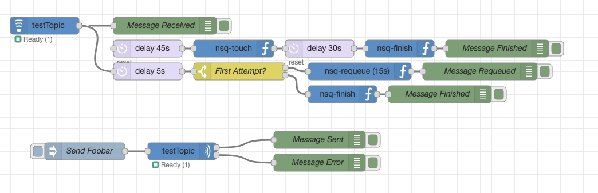

# node-red-contrib-nsq

A [NodeRED](https://nodered.org) Node for Subscribing and Publishing to [NSQ](https://nsq.io) Topics.



## Configuration

Currently, each configuration node is only capable of connecting directly to an nsqd instance. Simply provide a host and port. Support for nsqlookupd may be added in the future.

## Consuming Messages

Use the `nsq-consumer` node to subscribe to a topic channel. Optionally enable "Finish Immediately" to automatically "finish" the message. This node currently only supports one in-flight message at a time.

The node will reconnect automatically, and indicate "Ready" and the number of messages received since the last flow deployment.

If "Finish Immediately" is disabled, the message must reach an `nsq-finish` node before `msg._nsq.timeout` seconds (60 by default). You can optionally send the message to an `nsq-touch` node to extend the timeout by an additional `msg._nsq.timeout` seconds. Lastly, you can requeue your messages with the `nsq-requeue` node.

Each of the `nsq-finish`, `nsq-touch`, and `nsq-requeue` nodes only manipulate `msg._nsq`.


## Producing Messages

The node will reconnect automatically, and indicate "Ready" and the number of messages received since the last flow deployment.

Simply send a `msg.payload` and optional `msg.topic` to the `nsq-producer` node to send messages to an NSQ channel. The node does not manipulate the `msg`. In case of an error, the unmanipulated `msg` is sent on port 2.

### Eample Flow

Below is the example flow depicted above.

```json
[{"id":"815d6522.3a0368","type":"nsq-consumer","z":"7256ff08.e1332","connection":"bda31600.8aaee8","topic":"testTopic","channel":"node-red","finishImmediately":false,"x":100,"y":80,"wires":[["5a894cb9.61b1f4","e4d0d218.bf5e"]]},{"id":"bc186b0.bd2ff98","type":"inject","z":"7256ff08.e1332","name":"Send Foobar","topic":"","payload":"{\"foo\":\"bar\"}","payloadType":"json","repeat":"","crontab":"","once":false,"onceDelay":0.1,"x":170,"y":300,"wires":[["f4e9c3e0.052a7"]]},{"id":"5a894cb9.61b1f4","type":"debug","z":"7256ff08.e1332","name":"Message Received","active":true,"tosidebar":true,"console":false,"tostatus":false,"complete":"true","targetType":"full","x":310,"y":80,"wires":[]},{"id":"7180fa4f.bec1b4","type":"debug","z":"7256ff08.e1332","name":"Message Sent","active":true,"tosidebar":true,"console":false,"tostatus":false,"complete":"true","targetType":"full","x":580,"y":280,"wires":[]},{"id":"6bdd85f.dfa337c","type":"debug","z":"7256ff08.e1332","name":"Message Error","active":true,"tosidebar":true,"console":false,"tostatus":false,"complete":"true","targetType":"full","x":580,"y":320,"wires":[]},{"id":"f4e9c3e0.052a7","type":"nsq-producer","z":"7256ff08.e1332","connection":"bda31600.8aaee8","topic":"testTopic","x":340,"y":300,"wires":[["7180fa4f.bec1b4"],["6bdd85f.dfa337c"]]},{"id":"2dd89190.37329e","type":"debug","z":"7256ff08.e1332","name":"Message Finished","active":true,"tosidebar":true,"console":false,"tostatus":false,"complete":"true","targetType":"full","x":890,"y":120,"wires":[]},{"id":"f40381cb.e87ed","type":"delay","z":"7256ff08.e1332","name":"","pauseType":"delay","timeout":"45","timeoutUnits":"seconds","rate":"1","nbRateUnits":"1","rateUnits":"second","randomFirst":"1","randomLast":"5","randomUnits":"seconds","drop":false,"x":280,"y":120,"wires":[["b4e17c43.39b61"]]},{"id":"e67f31.320c40d","type":"delay","z":"7256ff08.e1332","name":"","pauseType":"delay","timeout":"30","timeoutUnits":"seconds","rate":"1","nbRateUnits":"1","rateUnits":"second","randomFirst":"1","randomLast":"5","randomUnits":"seconds","drop":false,"x":580,"y":120,"wires":[["91382503.521dd8"]]},{"id":"b4e17c43.39b61","type":"nsq-touch","z":"7256ff08.e1332","x":430,"y":120,"wires":[["e67f31.320c40d"]]},{"id":"91382503.521dd8","type":"nsq-finish","z":"7256ff08.e1332","x":720,"y":120,"wires":[["2dd89190.37329e"]]},{"id":"e4d0d218.bf5e","type":"delay","z":"7256ff08.e1332","name":"","pauseType":"delay","timeout":"5","timeoutUnits":"seconds","rate":"1","nbRateUnits":"1","rateUnits":"second","randomFirst":"1","randomLast":"5","randomUnits":"seconds","drop":false,"x":280,"y":160,"wires":[["8fe9fb44.bf75c8"]]},{"id":"8fe9fb44.bf75c8","type":"switch","z":"7256ff08.e1332","name":"First Attempt?","property":"_nsq.attempts","propertyType":"msg","rules":[{"t":"eq","v":"1","vt":"str"},{"t":"else"}],"checkall":"true","repair":false,"outputs":2,"x":440,"y":160,"wires":[["25867fe8.73f7a"],["3b7d3a34.ac9406"]]},{"id":"25867fe8.73f7a","type":"nsq-requeue","z":"7256ff08.e1332","name":"","delay":"15","backoff":false,"x":650,"y":160,"wires":[["904f9625.fa60e8"]]},{"id":"904f9625.fa60e8","type":"debug","z":"7256ff08.e1332","name":"Message Requeued","active":true,"tosidebar":true,"console":false,"tostatus":false,"complete":"true","targetType":"full","x":860,"y":160,"wires":[]},{"id":"3b7d3a34.ac9406","type":"nsq-finish","z":"7256ff08.e1332","x":620,"y":200,"wires":[["78659860.242738"]]},{"id":"78659860.242738","type":"debug","z":"7256ff08.e1332","name":"Message Finished","active":true,"tosidebar":true,"console":false,"tostatus":false,"complete":"true","targetType":"full","x":790,"y":200,"wires":[]},{"id":"bda31600.8aaee8","type":"nsq-connection","z":"","name":"Test","host":"nsqd","port":"4150"}]
```